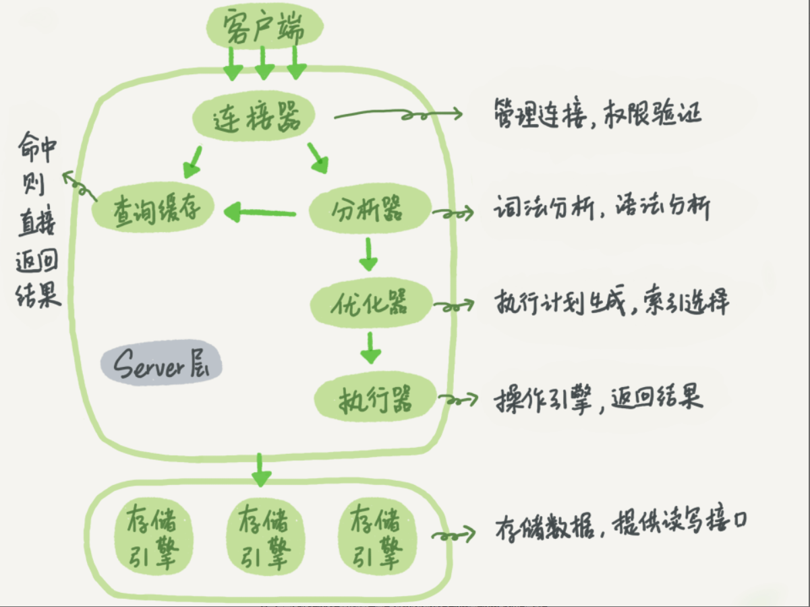
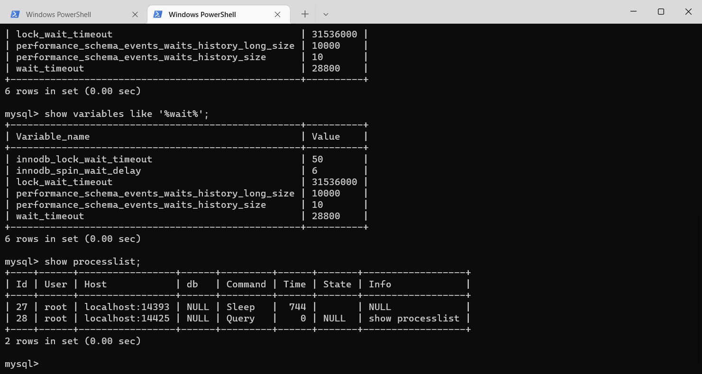

# MySQL实战45讲笔记

## 1、一条SQL查询语句是如何执行的？

MySQL的架构图如下所示



2. 总的来说MySQL可以分成两大部分 ==Server层和存储引擎层==
3. Server 层包括连接器、查询缓存、分析器、优化器、执行器等，涵盖 MySQL 的大多数核心服务功能，以及所有的内置函数（如日期、时间、数学和加密函数等），所有跨存储引擎的功能都在这一层实现，比如存储过程、触发器、视图等。
4. 存储引擎层负责数据的提取和存储，其架构模式是插件式的，支持 InnoDB、MyISAM、Memory 等多个存储引擎。现在最常用的存储引擎是 InnoDB，它从 MySQL 5.5.5 版本开始成为了默认存储引擎。
5. 不同的存储引擎共用的是一个server层

### 1.1、连接器

当我们输入```mysql -h$ip -P$port -u$user -p```的命令的时候，第一个接待我们的就是连接器，连接器负责和客户端建立连接，获取用户权限，维护和管理连接

1. 在完成经典的TCP连接之后，连接器开始验证用户的身份，如果用户名或者密码不正确的话->"Access denied for user"的错误
2. 如果用户名和密码通过了连接之后，连接器会在权限表中查询当前用户的权限信息，之后这个连接里面的判断逻辑都依赖于读到的权限信息，即使管理员对于这个用户的权限进行了修改也不会影响当前连接的权限
3. 连接完成之后，如果没有后续的动作的话，那么这个连接就是闲置状态，可以使用==```show processlist```==命令查看连接的状态



4. 客户端如果