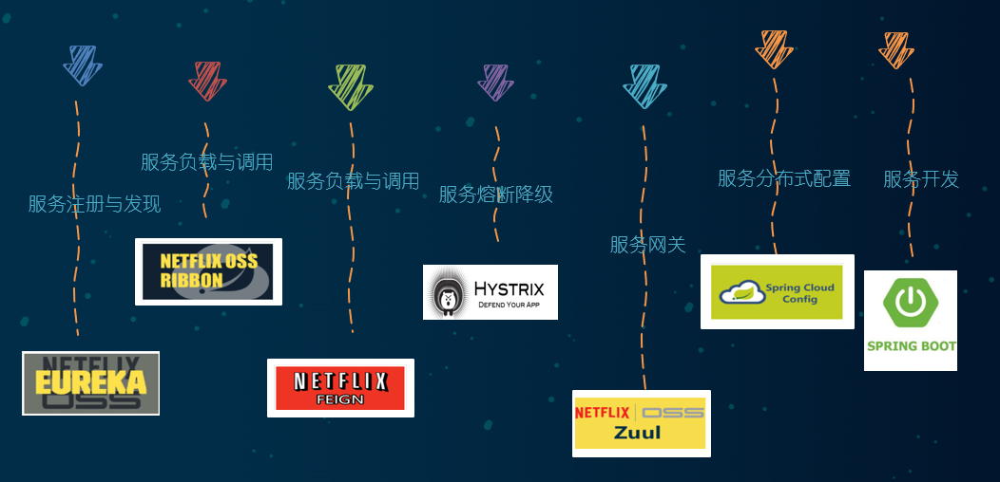

# SpringCloud 学习笔记

## 1. 什么是微服务架构

​		微服务架构是一种架构模式，它提倡将单一应用程序划分成一组小的服务，服务之间相互协调，互相配合，为用户提供最终价值，每个服务运行在其独立的进程中，服务于服务之间采用轻量级的通信机制相互协作（通常就是基于Http协议的RESTfulAPI），每个服务都围绕着具体业务进行构建，并且能够独立的部署到生产环境，类生产环境都能，另外，应当尽量毕苗苗统一的，集中式的服务管理机制，对具体的一个服务而言，应该更具业务上下文，选择合适的语言，工具进行构建

## 2. 什么是分布式系统

集群，分布式，微服务的相关概念和区别：集群是一个物理状态，集群是一种工作方式，分布式指的是将不同的业务放在不同的地方，集群指的是将几台服务器集中放在一起处理同一个业务，分布式中的每一个节点都可以做集群，而集群并不一定是分布式的，例如某网站如果访问的人数多了，就可以做一个集群，在前面加一个响应服务器，由响应服务器判断哪台服务器的访问量比较少，就由哪台服务器来处理这个请求(负载均衡)，分布式中的每一个节点都完成了不同的业务，如果节点出现了故障，那么将不能正常的进行访问，好的系统设计是分布式和集群一起使用，先分布式然后再集群，如果分布式中的某一个节点down掉了，也不会影响整个系统的正常运行，微服务和分布式的概念相似，微服务是一种架构风格，一个大型的软件应该由一个或者多个微服务构成，系统中的每个微服务都可以独立部署，各个微服务之间是松耦合的，每个微服务仅仅只关注一件任务，每个任务就代表一个小的业务功能，微服务的应用不一定是分散在多个服务器上的，它也可以时部署在同一台服务器上面的。

## 3. 关于Cloud各种组件的停更/升级/替换

1. 在以前相关的组件没有停更的时候使用的组件如下：



2. 现在使用的组件方式如下：


## 4. 微服务架构编码构建

### 1、创建cloud整体聚合父工程project

### 2、设置父项目的pom文件

父项目指定所有的依赖版本号，但是父项目只是规定了版本，实际依赖的导入还是需要在子项目中指定，另外需要将 Packing方式指定为pom方式，表示是父工程

```xml
<?xml version="1.0" encoding="UTF-8"?>
<project xmlns="http://maven.apache.org/POM/4.0.0" xmlns:xsi="http://www.w3.org/2001/XMLSchema-instance"
         xsi:schemaLocation="http://maven.apache.org/POM/4.0.0 http://maven.apache.org/xsd/maven-4.0.0.xsd">
    <modelVersion>4.0.0</modelVersion>

    <groupId>com.kyrie.study</groupId>
    <artifactId>cloud2022</artifactId>
    <version>1.0-SNAPSHOT</version>

    <packaging>pom</packaging>

    <properties>
        <project.build.sourceEncoding>UTF-8</project.build.sourceEncoding>
        <maven.compiler.source>1.8</maven.compiler.source>
        <maven.compiler.target>1.8</maven.compiler.target>
        <junit.version>4.12</junit.version>
        <log4j.version>1.2.17</log4j.version>
        <lombok.version>1.16.18</lombok.version>
        <mysql.version>5.1.47</mysql.version>
        <druid.version>1.1.16</druid.version>
        <spring.boot.version>2.2.2.RELEASE</spring.boot.version>
        <spring.cloud.version>Hoxton.SR1</spring.cloud.version>
        <spring.cloud.alibaba.version>2.1.0.RELEASE</spring.cloud.alibaba.version>
        <mybatis.spring.boot.version>1.3.0</mybatis.spring.boot.version>
    </properties>

    <dependencyManagement>
        <dependencies>
            <!--springboot 2.2.2-->
            <dependency>
                <groupId>org.springframework.boot</groupId>
                <artifactId>spring-boot-dependencies</artifactId>
                <version>${spring.boot.version}</version>
                <type>pom</type>
                <scope>import</scope>
            </dependency>
            <!--Spring cloud Hoxton.SR1-->
            <dependency>
                <groupId>org.springframework.cloud</groupId>
                <artifactId>spring-cloud-dependencies</artifactId>
                <version>${spring.cloud.version}</version>
                <type>pom</type>
                <scope>import</scope>
            </dependency>
            <!--Spring cloud alibaba 2.1.0.RELEASE-->
            <dependency>
                <groupId>com.alibaba.cloud</groupId>
                <artifactId>spring-cloud-alibaba-dependencies</artifactId>
                <version>${spring.cloud.alibaba.version}</version>
                <type>pom</type>
                <scope>import</scope>
            </dependency>
            <dependency>
                <groupId>mysql</groupId>
                <artifactId>mysql-connector-java</artifactId>
                <version>${mysql.version}</version>
            </dependency>
            <dependency>
                <groupId>com.alibaba</groupId>
                <artifactId>druid</artifactId>
                <version>${druid.version}</version>
            </dependency>
            <dependency>
                <groupId>org.projectlombok</groupId>
                <artifactId>lombok</artifactId>
            </dependency>
        </dependencies>
    </dependencyManagement>
    <build>
        <plugins>
            <plugin>
                <groupId>org.springframework.boot</groupId>
                <artifactId>spring-boot-maven-plugin</artifactId>
                <version>2.6.2</version>
                <configuration>
                    <fork>true</fork>
                    <addResources>true</addResources>
                </configuration>
            </plugin>
            <plugin>
                <artifactId>maven-compiler-plugin</artifactId>
                <version>3.1</version>
                <configuration>
                    <source>1.8</source>
                    <target>1.8</target>
                </configuration>
            </plugin>
        </plugins>

    </build>

    <!--第三方maven私服-->
    <repositories>
        <repository>
            <id>nexus-aliyun</id>
            <name>Nexus aliyun</name>
            <url>http://maven.aliyun.com/nexus/content/groups/public</url>
            <releases>
                <enabled>true</enabled>
            </releases>
            <snapshots>
                <enabled>false</enabled>
            </snapshots>
        </repository>
    </repositories>
</project>

```

### 3、创建cloud-provider-payment8001微服务提供者支付模块

#### 1、创建maven项目

#### 2、配置相关pom文件

父pom设置了版本号，子pom中就可以省略version字段

```xml
<?xml version="1.0" encoding="UTF-8"?>
<project xmlns="http://maven.apache.org/POM/4.0.0"
         xmlns:xsi="http://www.w3.org/2001/XMLSchema-instance"
         xsi:schemaLocation="http://maven.apache.org/POM/4.0.0 http://maven.apache.org/xsd/maven-4.0.0.xsd">
    <parent>
        <artifactId>cloud2022</artifactId>
        <groupId>com.kyrie.study</groupId>
        <version>1.0-SNAPSHOT</version>
    </parent>
    <modelVersion>4.0.0</modelVersion>

    <artifactId>cloud-provider-payment8001</artifactId>

    <properties>
        <maven.compiler.source>8</maven.compiler.source>
        <maven.compiler.target>8</maven.compiler.target>
    </properties>
    <dependencies>
        <!--springboot 2.2.2-->
        <dependency>
            <groupId>org.springframework.boot</groupId>
            <artifactId>spring-boot-dependencies</artifactId>
            <type>pom</type>
        </dependency>
        <!--Spring cloud Hoxton.SR1-->
        <dependency>
            <groupId>org.springframework.cloud</groupId>
            <artifactId>spring-cloud-dependencies</artifactId>
            <type>pom</type>
        </dependency>
        <!--Spring cloud alibaba 2.1.0.RELEASE-->
        <dependency>
            <groupId>com.alibaba.cloud</groupId>
            <artifactId>spring-cloud-alibaba-dependencies</artifactId>
            <type>pom</type>
        </dependency>
        <dependency>
            <groupId>mysql</groupId>
            <artifactId>mysql-connector-java</artifactId>
        </dependency>
        <dependency>
            <groupId>com.alibaba</groupId>
            <artifactId>druid</artifactId>
        </dependency>
        <dependency>
            <groupId>org.springframework.boot</groupId>
            <artifactId>spring-boot-starter-web</artifactId>
        </dependency>
        <dependency>
            <groupId>org.springframework.boot</groupId>
            <artifactId>spring-boot-starter-actuator</artifactId>
        </dependency>
        <dependency>
            <groupId>org.mybatis.spring.boot</groupId>
            <artifactId>mybatis-spring-boot-starter</artifactId>
            <version>2.2.0</version>
        </dependency>
        <dependency>
            <groupId>org.projectlombok</groupId>
            <artifactId>lombok</artifactId>
            <version>1.18.22</version>
        </dependency>
        <dependency>
            <groupId>org.springframework.boot</groupId>
            <artifactId>spring-boot-devtools</artifactId>
            <scope>runtime</scope>
            <optional>true</optional>
        </dependency>
        <dependency>
            <groupId>org.example</groupId>
            <artifactId>cloud-api-commons</artifactId>
        </dependency>
        <dependency>
            <groupId>org.springframework.cloud</groupId>
            <artifactId>spring-cloud-starter-netflix-eureka-client</artifactId>
        </dependency>
    </dependencies>
    <build>
        <plugins>
            <plugin>
                <artifactId>maven-compiler-plugin</artifactId>
                <version>3.1</version>
                <configuration>
                    <source>1.8</source>
                    <target>1.8</target>
                </configuration>
            </plugin>
        </plugins>
    </build>
</project>
```

#### 3、修改pom文件，编写启动类

```yml
server:
  port: 8001
spring:
  datasource:
    url: jdbc:mysql://localhost:3306/springcloud?Unicode=true&characterEncoding=utf-8&useSSL=false&serverTimezone=UTC
    username: root
    password: 252525
    type: com.alibaba.druid.pool.DruidDataSource # 当前数据源操作类型
    driver-class-name: com.mysql.jdbc.Driver # 指定数据库的驱动

# 指定mybatis的mapper文件位置，以及所有别名类所在的包
mybatis:
  mapperLocations: classpath:mapper/*.xml
  type-aliases-package: com.kyrie.study.domain # 指定实体别名包

```

#### 4、创建数据库表

```sql
 CREATE TABLE `payment` (
  `id` bigint(20) NOT NULL AUTO_INCREMENT COMMENT 'ID',
  `serial` varchar(200) DEFAULT '',
  PRIMARY KEY (`id`)
) ENGINE=InnoDB AUTO_INCREMENT=1 DEFAULT CHARSET=utf8
```

#### 5、创建实体类和公共的返回对象

```java
@AllArgsConstructor
@NoArgsConstructor
@Data
public class Payment implements Serializable {
    //主键id
    private Long id;
    //交易订单号
    private String serial;
}
```

```java
@AllArgsConstructor
@NoArgsConstructor
@Data
public class CommonResult<T>{
    private Integer code;
    private String message;
    private T data;
    public CommonResult(Integer code,String message){
        this(code,message,null);
    }
}
```

#### 6、创建Dao接口

```java
@Mapper
public interface PaymentDao {
    /**
     *向数据库中插入一条数据
     * @param payment
     * @return
     */
    public int create(Payment payment);

    /**
     * 通过id值查询指定的payment信息
     * @param id
     * @return
     */
    public Payment getPaymentById(@Param("id") Long id);
}
```

#### 7、创建controller

```java
@RestController
@Slf4j
public class PaymentController {

    @Autowired
    PaymentService service;
    
    @Value("${server.port}")
    private String serverPort;
    
    @GetMapping("/payment/find/{id}")
    public CommonResult getPaymentById(@PathVariable("id") Long id){
        Payment result = service.getPaymentById(id);
        if(result==null){
            return new CommonResult(500,"未查询到相关信息");
        }
        return new CommonResult(200,"查询数据成功:serverPort:"+serverPort,result);
    }

    @PostMapping("/payment/create")
    public CommonResult createPayment(@RequestBody Payment payment){
        
        int result = service.create(payment);
        if(result>0){
            return new CommonResult(200,"插入数据成功serverPort:"+serverPort,result);
        }
        return new CommonResult(500,"插入数据失败serverPort:"+serverPort);
    }
}
```

#### 8、service层

```java
public interface PaymentService{
    /**
     *向数据库中插入一条数据
     * @param payment
     * @return
     */
    public int create(Payment payment);

    /**
     * 通过id值查询指定的payment信息
     * @param id
     * @return
     */
    public Payment getPaymentById(@Param("id") Long id);
}
```

```java
@Service
public class PaymentServiceImp implements PaymentService {
    @Autowired
    private PaymentDao dao;

    @Override
    public int create(Payment payment) {
        return dao.create(payment);
    }

    @Override
    public Payment getPaymentById(Long id) {
        return dao.getPaymentById(id);
    }
}
```

### 4、 创建cloud-consumer-order80微服务消费者

#### 1、创建pom.xml文件

```xml
<?xml version="1.0" encoding="UTF-8"?>
<project xmlns="http://maven.apache.org/POM/4.0.0"
         xmlns:xsi="http://www.w3.org/2001/XMLSchema-instance"
         xsi:schemaLocation="http://maven.apache.org/POM/4.0.0 http://maven.apache.org/xsd/maven-4.0.0.xsd">
    <parent>
        <artifactId>cloud2022</artifactId>
        <groupId>com.kyrie.study</groupId>
        <version>1.0-SNAPSHOT</version>
    </parent>
    <modelVersion>4.0.0</modelVersion>

    <artifactId>cloud-consumer-payment80</artifactId>

    <properties>
        <maven.compiler.source>8</maven.compiler.source>
        <maven.compiler.target>8</maven.compiler.target>
    </properties>
    
    <dependencies>
        <dependency>
            <groupId>org.springframework.boot</groupId>
            <artifactId>spring-boot-starter-actuator</artifactId>
        </dependency>
        <dependency>
            <groupId>org.springframework.boot</groupId>
            <artifactId>spring-boot-starter-web</artifactId>
        </dependency>
        <dependency>
            <groupId>org.springframework.boot</groupId>
            <artifactId>spring-boot-starter-test</artifactId>
        </dependency>
        <dependency>
            <groupId>org.projectlombok</groupId>
            <artifactId>lombok</artifactId>
            <version>1.18.22</version>
        </dependency>
    </dependencies>
    <build>
        <plugins>
            <plugin>
                <artifactId>maven-compiler-plugin</artifactId>
                <version>3.1</version>
                <configuration>
                    <source>1.8</source>
                    <target>1.8</target>
                </configuration>
            </plugin>
        </plugins>
    </build>

</project>
```

#### 2、创建实体类和公共的返回对象（内容和上面一致）

#### 3、创建配置类引入restTemplate

因为现在还没有使用注册中心的缘故，所以只能使用restTemplate发送http请求

```java
@Configuration
public class ApplicationConfig {
    /**
     * 加载RestTemplate 对象
     * @return
     */
    @Bean
    public RestTemplate template(){
        return new RestTemplate();
    }
}
```

#### 4、创建controller用于访问provider提供的服务

```java
@RestController
public class OrderController {

    private static final String PAYMENT_URL="http://localhost:8001";
    @Autowired
    private RestTemplate template;

    @GetMapping("/consumer/payment/find/{id}")
    public CommonResult<Payment> findPayment(@PathVariable("id") Long id){
        CommonResult result = template.getForObject(PAYMENT_URL + "/payment/find/"+id+"", CommonResult.class);
        return result;
    }

    @GetMapping("/consumer/payment/create")
    public CommonResult<Payment> createPayment(Payment payment){
        CommonResult result = template.postForObject(PAYMENT_URL + "/payment/create", payment, CommonResult.class);
        return result;
    }
}
```

#### 5、 设置applicaition.yml文件

```yml
server:
  port: 80
spring:
  application:
    name: cloud-order-service
```

### 5、提取公共的实体类和返回类

在provider和consumer中都存在了一份相同的实体类和返回值，所以我们可以将其抽取到同一个公有包中

#### 1、设置pom.xml文件

```xml
<?xml version="1.0" encoding="UTF-8"?>
<project xmlns="http://maven.apache.org/POM/4.0.0"
         xmlns:xsi="http://www.w3.org/2001/XMLSchema-instance"
         xsi:schemaLocation="http://maven.apache.org/POM/4.0.0 http://maven.apache.org/xsd/maven-4.0.0.xsd">
    <modelVersion>4.0.0</modelVersion>

    <groupId>org.example</groupId>
    <artifactId>cloud-api-commons</artifactId>
    <version>1.0-SNAPSHOT</version>

    <properties>
        <maven.compiler.source>8</maven.compiler.source>
        <maven.compiler.target>8</maven.compiler.target>
    </properties>
    <dependencies>
        <!--热部署 -->
        <dependency>
            <groupId>org.springframework.boot</groupId>
            <artifactId>spring-boot-devtools</artifactId>
            <version>2.6.1</version>
            <scope>runtime</scope>
            <optional>true</optional>
        </dependency>
        <dependency>
            <groupId>org.projectlombok</groupId>
            <artifactId>lombok</artifactId>
            <version>1.18.22</version>
            <optional>true</optional>
        </dependency>
        <!--工具类，用于后面格式化时间等操作 -->
        <dependency>
            <groupId>cn.hutool</groupId>
            <artifactId>hutool-all</artifactId>
            <version>5.1.0</version>
        </dependency>
    </dependencies>
    <build>
        <plugins>
            <plugin>
                <artifactId>maven-compiler-plugin</artifactId>
                <version>3.1</version>
                <configuration>
                    <source>1.8</source>
                    <target>1.8</target>
                </configuration>
            </plugin>
        </plugins>
    </build>

</project>
```

#### 2、将公共包进行打包操作


#### 3、在consumer和provider中删除实体类和公共返回类

删除之后先在父pom中添加再向子pom.xml中导入公共包的坐标

父项目中添加如下配置

```xml
<dependency>
    <groupId>org.example</groupId>
    <artifactId>cloud-api-commons</artifactId>
    <version>1.0-SNAPSHOT</version>
</dependency>
```

子项目中配置如下

```xml
<dependency>
    <groupId>org.example</groupId>
    <artifactId>cloud-api-commons</artifactId>
</dependency>
```

## 5、单机版本Eureka配置

### 1、生成eurekaServer7001为注册中心

#### 1、 创建项目，添加依赖到pom文件中

以前的server和client导入的都是同一个项目依赖，现在注册中心和client导入的依赖不同


```xml
<?xml version="1.0" encoding="UTF-8"?>
<project xmlns="http://maven.apache.org/POM/4.0.0"
         xmlns:xsi="http://www.w3.org/2001/XMLSchema-instance"
         xsi:schemaLocation="http://maven.apache.org/POM/4.0.0 http://maven.apache.org/xsd/maven-4.0.0.xsd">
    <parent>
        <artifactId>cloud2022</artifactId>
        <groupId>com.kyrie.study</groupId>
        <version>1.0-SNAPSHOT</version>
    </parent>
    <modelVersion>4.0.0</modelVersion>

    <artifactId>cloud-eureka-server7001</artifactId>

    <properties>
        <maven.compiler.source>8</maven.compiler.source>
        <maven.compiler.target>8</maven.compiler.target>
    </properties>
    <dependencies>
        <!--eureka-server，注册中心导入的依赖-->
        <dependency>
            <groupId>org.springframework.cloud</groupId>
            <artifactId>spring-cloud-starter-netflix-eureka-server</artifactId>
        </dependency>
        <!-- 引入自己定义的api通用包，可以使用Payment支付Entity -->
        <dependency>
            <groupId>org.example</groupId>
            <artifactId>cloud-api-commons</artifactId>
        </dependency>
        <!--boot web actuator-->
        <dependency>
            <groupId>org.springframework.boot</groupId>
            <artifactId>spring-boot-starter-web</artifactId>
        </dependency>
        <dependency>
            <groupId>org.springframework.boot</groupId>
            <artifactId>spring-boot-starter-actuator</artifactId>
        </dependency>
        <!--一般通用配置-->
        <dependency>
            <groupId>org.springframework.boot</groupId>
            <artifactId>spring-boot-devtools</artifactId>
            <scope>runtime</scope>
            <optional>true</optional>
        </dependency>
        <dependency>
            <groupId>org.projectlombok</groupId>
            <artifactId>lombok</artifactId>
            <version>1.18.22</version>
        </dependency>
        <dependency>
            <groupId>org.springframework.boot</groupId>
            <artifactId>spring-boot-starter-test</artifactId>
            <scope>test</scope>
        </dependency>
        <dependency>
            <groupId>junit</groupId>
            <artifactId>junit</artifactId>
        </dependency>
    </dependencies>
</project>
```

#### 2、修改application.yml文件

```yml
server:
  port: 7001
eureka:
  instance:
    hostname: localhost #eureka服务端实例的名称
  client:
    # false表示不想注册中心注册自己
    register-with-eureka: false
    # false表示自己端就是注册中心，我的职责就是维护服务实例，不需要去检索服务
    fetch-registry: false
    # 设置与Eureka Server交互的地址查询服务和注册服务都需要依赖这个地址
    defaultZone: http://${eureka.instance.hostname}:${server.port}/eureka/
```

#### 3、在启动类上添加server注解，声明自己是注册中心

```java
@SpringBootApplication
@EnableEurekaServer //代表我这个是服务的注册中心
public class EurekaMain7001 {
    public static void main(String[] args) {
        SpringApplication.run(EurekaMain7001.class, args);
    }
}
```

### 2、将cloud-provider-payment8001注册到注册中心中

#### 1、修改pom文件添加client依赖

```xml
<dependency>
    <groupId>org.springframework.cloud</groupId>
    <artifactId>spring-cloud-starter-netflix-eureka-client</artifactId>
</dependency>
```

#### 2、在配置文件中配置eureka相关的属性值

```yml
##配置eureka的相关配置
eureka:
  client:
    register-with-eureka: true # 表示是否将自己注册到注册中心
    # 是否从EurekaServer抓取已有的注册信息，默认是true。单节点无所谓，集群必须设置为true,才能配合Ribbon使用负载均衡
    fetch-registry: true
    service-url:
      defaultZone: http://localhost:7001/eureka
```

#### 3、主启动类标明client注解

```java
/**
 * @author KyrieStudy
 * @version 1.0
 * @date 2022/1/20 22:56
 */
@SpringBootApplication
//声明自己为client端，需要注册到注册中心
@EnableEurekaClient 
public class PaymentMain8001 {
    public static void main(String[] args) {
        SpringApplication.run(PaymentMain8001.class,args);
    }
}
```

#### 4、将payment80服务注册到eureka注册中心中

1. 在pom文件中引入依赖

```xml
<dependency>
    <groupId>org.springframework.cloud</groupId>
    <artifactId>spring-cloud-starter-netflix-eureka-client</artifactId>
</dependency>
```

2. 配置文件中配置eureka的相关属性

```yml
eureka:
  client:
    register-with-eureka: true
    fetch-registry: true
    service-url:
      defaultZone: http://localhost:7001/eureka
```

3. 主启动类添加@EnableEurekaClient注解

```java
@SpringBootApplication
@EnableEurekaClient
public class OrderMain80 {
    public static void main(String[] args) {
        SpringApplication.run(OrderMain80.class,args);
    }
}
```

#### 5、测试启动

1. 先启动eurekaServer服务器
2. 通过localhost:7001进行访问


3. 设置的spring.applicaiton.name就是服务注册到注册中心的应用名


## 6、集群版本Eureka配置

### 1、 了解什么是服务治理

**服务治理**就是提供了微服务架构中各微服务实例的快速上线或下线且保持各服务能正常通信的能力的方案总称。

服务治理的优点：

1. 更高的可用性：服务治理可以支持动态的服务实例集群环境，任何服务实例可以随时上线或下线。并且当一个服务实例不可用时，治理服务器可以将请求转给其他服务提供者，当一个新的服务实例上线时，也能够快速地分担服务调用请求。
2. 负载均衡：服务治理可以提供动态的负载均衡功能，可以将所有请求动态地分布到其所管理的所有服务实例中进行处理。
3. 提升应用的弹性：
4. 服务治理的客户端会定时从服务治理服务器中复制一份服务实例信息缓存到本地中，这样即使当服务治理服务器不可用时，服务消费者也可以使用本地的缓存去访问相应的服务，而不至于中断服务。通过这种机制，极大地提高了应用的弹性。
5. 高可用性集群：可以构建服务治理集群，通过互相注册机制，将每个治理服务器所管辖的服务信息列表进行交换，使服务治理服务拥有更高的可用性


### 2、创建一个和eureka-server7001一样的项目

### 3、Eureka集群的和核心理念

Eureka集群相互注册，由于我们只有一台电脑，多个eureka-server的hostname都写成localhost的话不方便进行区分，所以做一个域名映射 ，在电脑的host文件中添加以下两行

```
127.0.0.1 eureka7001.com
127.0.0.1 eureka7002.com
127.0.0.1 eureka7003.com
```

### 4、修改原来的配置文件

server7001的配置文件如下，7002的配置文件和以下相似

```yml
server:
  port: 7001
eureka:
  instance:
    hostname: eureka7001.com 
  client:
    # false表示不想注册中心注册自己
    register-with-eureka: false
    # false表示自己端就是注册中心，我的职责就是维护服务实例，不需要去检索服务
    fetch-registry: false
    service-url:
      defaultZone: http://eureka7002.com:7002/eureka/ # 相互注册，填的是其他注册中心的地址
```

### 5、分别启动7001和7002进行测试


### 6、将三个provider服务注册到注册中心中

分别修改三个provider的配置文件

```yml
##配置eureka的相关配置
eureka:
  client:
    register-with-eureka: true # 表示是否将自己注册到注册中心
    # 是否从EurekaServer抓取已有的注册信息，默认是true。单节点无所谓，集群必须设置为true，
    # 才能配合Ribbon使用负载均衡
    fetch-registry: true
    service-url:
      defaultZone: 	
      # 将服务注册到指定的集群中
http://eureka7001.com:7001/eureka,http://eureka7002.com:7002/eureka,http://eureka7003.com:7003/eureka

```

启动后显示结果如下图所示


### 7、调用consumer去访问provider服务

1. 修改访问的基地址为provider对外统一提供的地址

```java
package com.kyrie.study.controller;

import com.kyrie.study.domain.CommonResult;
import com.kyrie.study.domain.Payment;
import org.springframework.beans.factory.annotation.Autowired;
import org.springframework.web.bind.annotation.GetMapping;
import org.springframework.web.bind.annotation.PathVariable;
import org.springframework.web.bind.annotation.RestController;
import org.springframework.web.client.RestTemplate;

/**
 * @author KyrieStudy
 * @version 1.0
 * @date 2022/1/22 11:04
 */
@RestController
public class OrderController {

//    private static final String PAYMENT_URL="http://localhost:8001";
    /**
    * 使用上图中对外暴露的provider的服务名称，不能将地址写死
    */
    private static final String PAYMENT_URL="http://CLOUD-PAYMENT-SERVICE";
    @Autowired
    private RestTemplate template;

    @GetMapping("/consumer/payment/find/{id}")
    public CommonResult<Payment> findPayment(@PathVariable("id") Long id){
        CommonResult result = template.getForObject(PAYMENT_URL + "/payment/find/"+id+"", CommonResult.class);
        return result;
    }

    @GetMapping("/consumer/payment/create")
    public CommonResult<Payment> createPayment(Payment payment){
        CommonResult result = template.postForObject(PAYMENT_URL + "/payment/create", payment, CommonResult.class);
        return result;
    }
}
```

2. 修改config配置文件

```java
/**
 * @author KyrieStudy
 * @version 1.0
 * @date 2022/1/22 11:20
 */
@Configuration
public class ApplicationConfig {
    /**
     * 加载RestTemplate 对象
     * @return
     */
    @Bean
    //添加此注解开启restTemplate的负载均衡策略，默认为轮询
    @LoadBalanced 
    public RestTemplate template(){
        return new RestTemplate();
    }
}
```

## 7.服务发现Discovrery

对于注册到eureka的服务来说，可以通过服务发现的方式来获取该服务的信息

### 1、修改provider中的controller，添加以下内容

通过Resource注解将DiscoveryClient注入

```java
@RestController
@Slf4j
public class PaymentController {

    @Resource
    private DiscoveryClient discoveryClient;

    @GetMapping("/payment/discovery")
    public CommonResult discovery(){
        //获取所有注册到注册中心的服务的名称
        List<String> services = discoveryClient.getServices();
        //创建返回对象
        ServiceInfo serviceInfo=new ServiceInfo();
        //创建服务名称列表
        List<String> serviceNameList=new ArrayList<>();
        for (String service : services) {
            serviceNameList.add(service);
        }
        serviceInfo.setServiceNameList(serviceNameList);
        //获取指定微服务名称下所有机器的信息列表
        List<ServiceInstance> instances = discoveryClient.getInstances("CLOUD-PAYMENT-SERVICE");
        List<HostInfo> hostInfos=new ArrayList<>();
        for (ServiceInstance instance : instances) {
            HostInfo hostInfo=new HostInfo();
            hostInfo.setHostName(instance.getHost());
            hostInfo.setPort(instance.getPort());
            hostInfo.setUrl(instance.getUri().toString());
            hostInfos.add(hostInfo);
        }
        serviceInfo.setInfoList(hostInfos);
        return new CommonResult(200,"成功!",serviceInfo);
    }
}
```

### 2、在主启动类上添加@EnableDiscoveryClient 注解

### 3、测试结果如下所示


## 8、使用zookeeper当做注册中心

#### 1、添加pom依赖

```xml
<!-- SpringBoot整合zookeeper客户端 -->
<dependency>
    <groupId>org.springframework.cloud</groupId>
    <artifactId>spring-cloud-starter-zookeeper-discovery</artifactId>
</dependency>
```

#### 2、配置application.yml文件

```yml
server:
  port: 8003
#服务别名----注册zookeeper到注册中心名称
spring:
  application:
    name: cloud-provider-payment
  cloud:
    zookeeper:
      connect-string: 192.168.101.101:2181,192.168.101.102:2181,192.168.101.103:2181
```

#### 3、查看zookeeper节点信息

使用get命令获取节点的信息

```get /services/cloud-provider-payment/e83f3d48-ce47-4222-af52-ac82d42d6656```

```json
{
    "name":"cloud-provider-payment",
    "id":"e83f3d48-ce47-4222-af52-ac82d42d6656",
    "address":"localhost",
    "port":8003,
    "sslPort":null,
    "payload":{
        "@class":"org.springframework.cloud.zookeeper.discovery.ZookeeperInstance",
        "id":"application-1",
        "name":"cloud-provider-payment",
        "metadata":{

        }
    },
    "registrationTimeUTC":1651891357216,
    "serviceType":"DYNAMIC",
    "uriSpec":{
        "parts":[
            {
                "value":"scheme",
                "variable":true
            },
            {
                "value":"://",
                "variable":false
            },
            {
                "value":"address",
                "variable":true
            },
            {
                "value":":",
                "variable":false
            },
            {
                "value":"port",
                "variable":true
            }
        ]
    }
}
```

## 9、使用Consul作为服务注册中心

### 1、Consul下载地址：https://www.consul.io/downloads.html

### 2、如何在linux中安装consul，官网示例如下


### 3、如何在window和linux中启动consul

**Windows**: consul agent -dev

**linux**: consul agent -dev -client 0.0.0.0 --ui

访问路径：http://ip地址:8500


服务注册和发现查看MindManager文档

## 10、Ribbon实现负载均衡调用

#### 1、什么是Ribbon

Spring Cloud Ribbon是基于Netflix Ribbon实现的一套客户端       负载均衡的工具。

简单的说，Ribbon是Netflix发布的开源项目，主要功能是提供==客户端==的软件负载均衡算法和服务调用。Ribbon客户端组件提供一系列完善的配置项如连接超时，重试等。简单的说，就是在配置文件中列出Load Balancer（简称LB）后面所有的机器，Ribbon会自动的帮助你基于某种规则（如简单轮询，随机连接等）去连接这些机器。我们很容易使用Ribbon实现自定义的负载均衡算法。

#### 2、什么是负载均衡

简单来说负载均衡就是将用户的请求平摊到不同的服务器上面从而实现系统的高可用(HA)

#### 3、Ribbon和Nginx负载均衡的区别

Nginx是服务器负载均衡策略，客户端将所有的请求都nginx，然后由nginx实现请求转发。即负载均衡由服务器实现

Ribbon本地负载均衡策略，在调用服务接口的时候会在注册中心上获取服务注册信息列表之后缓存到JVM本地，从而在本地实现了RPC的远程调用

#### 4、Ribbon调用的结构流程

1. 第一步是选择Eureka Server，优先选择同一区域内负载较少的server	
2. 根据用户的负载策略，从Server中的注册实例列表中选取一个地址进行调用


#### 5、如何引入Ribbon

如果需要单独引入ribbon的话就按照以下方式

```xml
<dependency>
    <groupId>org.springframework.cloud</groupId>
    <artifactId>spring-cloud-starter-netflix-ribbon</artifactId>
</dependency>
```

很多现成的服务注册中心都会引入Ribbon依赖 	 	


#### 6、如何自定义轮训规则

1. 首先，Ribbon是基于客户端的轮训，我们需要在消费端配置自定义的规则
2. 官方明确规定不能将配置类放到componentScan能够扫描到的地方，所以不能放在启动类和启动类的子包下面


3. 按照下图所示的方式创建配置类


4. 配置内容如下，修改轮询规则，然后在主启动类配置将对哪个服务实施以下的规则

```java
@Configuration
public class BalanceRuleConfig {

    @Bean
    public IRule myRule(){
        //将轮训规则修改为随机
        return new RandomRule();
    }

}
```

以下表示的含义就是对于CLOUD-PAYMENT-SERVICE这个服务使用BanlanceRuleConfig所配置的轮训规则

```java
@SpringBootApplication
@EnableEurekaClient
@RibbonClient(name = "CLOUD-PAYMENT-SERVICE",configuration= BalanceRuleConfig.class)
public class OrderMain80 {
    public static void main(String[] args) {
        SpringApplication.run(OrderMain80.class,args);
    }
}
```

#### 7、负载均衡算法原理


## 11、OpenFeign相关使用介绍

Feign是一个声明式WebService客户端。使用Feign能让编写Web Service客户端更加简单。
它的使用方法是定义一个==服务接口==然后在上面添加==注解==。Feign也支持可拔插式的编码器和解码器。Spring Cloud对Feign进行了封装，使其支持了Spring MVC标准注解和HttpMessageConverters。Feign可以与Eureka和Ribbon组合使用以支持负载均衡

#### 1、 Feign能干什么

Feign旨在使编写Java Http客户端变得更容易。
前面在使用Ribbon+RestTemplate时，利用RestTemplate对http请求的封装处理，形成了一套模版化的调用方法。但是在实际开发中，由于对服务依赖的调用可能不止一处，往往一个接口会被多处调用，所以通常都会针对每个微服务自行封装一些客户端类来包装这些依赖服务的调用。所以，Feign在此基础上做了进一步封装，由他来帮助我们定义和实现依赖服务接口的定义。在Feign的实现下，我们只需创建一个接口并使用注解的方式来配置它(以前是Dao接口上面标注Mapper注解,现在是一个微服务接口上面标注一个Feign注解即可)，即可完成对服务提供方的接口绑定，简化了使用Spring cloud Ribbon时，自动封装服务调用客户端的开发量。

#### 2、Feign集成了Ribbon

利用Ribbon维护了Payment的服务列表信息，并且通过轮询实现了客户端的负载均衡。而与Ribbon不同的是，通过feign只需要定义服务绑定接口且以声明式的方法，优雅而简单的实现了服务调用

#### 3、如何使用OpenFeign

OpenFeign主要使用在消费者端用于服务的调用，代替之前的RestTemplate+Ribbon的组合

```xml
<!--openfeign-->
        <dependency>
            <groupId>org.springframework.cloud</groupId>
            <artifactId>spring-cloud-starter-openfeign</artifactId>
        </dependency>
```

yml配置文件，使用Eureka作为注册中心

```yml
server:
  port: 80

eureka:
  client:
    register-with-eureka: false
    service-url:
      defaultZone: http://eureka7001.com:7001/eureka/,http://eureka7002.com:7002/eureka/
```

在主启动类上添加如下注解

```java
@SpringBootApplication
@EnableFeignClients //表示开启OpenFeign使用
public class Payment80OpenFeign {
    public static void main(String[] args) {
        SpringApplication.run(Payment80OpenFeign.class,args);
    }
}
```

新增业务接口接口中的方法对标provider中的controller方法

```java
@FeignClient(value="CLOUD-PAYMENT-SERVICE") //value表示调用的是CLOUD-PAYMENT-SERVICE服务的方法
public interface PaymentService {
    //这个路径必须和服务实现方的路径相同
    @GetMapping(value = "/payment/find/{id}")
    CommonResult<Payment> getPaymentById(@PathVariable("id") Long id);
}
```

以下是提供者的服务实现

```java
@GetMapping("/payment/find/{id}")
public CommonResult getPaymentById(@PathVariable("id") Long id){
    log.info("我知道是我了：{}",id);
    Payment result = service.getPaymentById(id);
    if(result==null){
        return new CommonResult(500,"未查询到相关信息");
    }
    return new CommonResult(200,"查询数据成功:serverPort:"+serverPort,result);
}
```

在controller中调用接口中的方法

```java
@RestController
public class PaymentController {

    @Autowired
    private PaymentService paymentService;

    @GetMapping(value = "/consumer/payment/get/{id}")
    CommonResult<Payment> getPaymentById(@PathVariable("id") Long id){
        CommonResult<Payment> result = paymentService.getPaymentById(id);
        return result;
    }
}
```

#### 4、简单总结openFeign的使用方法

1. 在启动类上添加@EnableFeignClients注解
2. 在接口上添加@FeignClient("被调用服务注册名")
3. 在需要使用的地方@Resource注解使用

​	openfeign的用途：服务发现，负载均衡，服务调用

​	openfeign的实现原理：基于@EnableFeignClients 将所有被@FeignClient注解的类 注册到容器中。当这些被@FeignClient注解的类被	调用时会创建一个动态代理的对象为我们创建被调用类的实例，然后都会被统一转发给 Feign 框架所定义的一个 InvocationHandler ， 	由该 Handler 完成后续的 HTTP 转换， 发送， 接收， 翻译HTTP响应的工作。

#### 5、OpenFeign的默认超时

在不进行设置的时候OpenFeign进行服务的调用默认是1秒钟

调用超时会抛出```java.net.SocketTimeoutException: Read timed out```的异常信息

需要在yml文件中配置超时时间,单位是毫秒

```yml
#设置feign客户端超时时间(OpenFeign默认支持ribbon)
ribbon:
#指的是建立连接所用的时间，适用于网络状况正常的情况下,两端连接所用的时间
  ReadTimeout: 5000
#指的是建立连接后从服务器读取到可用资源所用的时间
  ConnectTimeout: 5000
```

## 12、HyStrix断路器

当前分布式系统面临的问题，当多个服务之间相互调用的时候可能会触发==服务雪崩==,所谓的雪崩，假设微服务A调用微服务B，微服务B去调用微服务C，这就是所谓的“扇出”，当扇出的链路中调用时间过长或者响应出现了问题，那么会导致其他访问该服务的得不到响应，系统的资源就一直不会被释放，最终导致服务A占用资源过多，甚至系统崩溃。对于高流量的应用来说，单一的后端依赖可能会导致所有服务器上的所有资源都在几秒钟内饱和。比失败更糟糕的是，这些应用程序还可能导致服务之间的延迟增加，备份队列，线程和其他系统资源紧张，导致整个系统发生更多的级联故障。这些都表示需要对故障和延迟进行隔离和管理，以便单个依赖关系的失败，不能取消整个应用程序或系统。所以，
通常当你发现一个模块下的某个实例失败后，这时候这个模块依然还会接收流量，然后这个有问题的模块还调用了其他的模块，这样就会发生级联故障，或者叫雪崩。

#### 1、什么是HyStrix


Hystrix是一个用于处理分布式系统的==延迟==和==容错==的开源库，在分布式系统里，许多依赖不可避免的会调用失败，比如超时、异常等，Hystrix能够保证在一个依赖出问题的情况下，不会导致整体服务失败，避免级联故障，以提高分布式系统的弹性。

“断路器”本身是一种开关装置，当某个服务单元发生故障之后，通过断路器的故障监控（类似熔断保险丝），向调用方返回一个符合预期的、可处理的备选响应（FallBack），而不是长时间的等待或者抛出调用方无法处理的异常，这样就保证了服务调用方的线程不会被长时间、不必要地占用，从而避免了故障在分布式系统中的蔓延，乃至雪崩。

#### 2、HyStrix的三个重要概念

##### 2.1、服务降级

服务降级指的是当程序出现异常 ，响应超时，服务熔断触发服务降级，线程池/信号量打满也会导致服务降级，给客户端一个良好的返回信息，不让客户端进行等待

##### 2.2、服务熔断

类比保险丝达到最大服务访问后，直接拒绝访问，拉闸限电，然后调用服务降级的方法并返回友好提示

##### 2.3、服务限流

秒杀高并发等操作，严禁一窝蜂的过来拥挤，大家排队，一秒钟N个，有序进行

#### 3、服务降级和服务熔断的区别

1. 服务降级是当服务器响应时间过长，出现宕机等情况 ，不要让客户端进行等待，就会调用服务降级方法快速响应

2. 服务熔断是在一定的时间内服务调用失败达到一定的次数，启动服务熔断，进而调用服务降级方法快速响应
3. 服务降级是每次会先调用正常的方法，当方法执行失败之后执行服务降级的方法，而在服务熔断状态下直接调用服务降级方法 “熔断后不可用”

