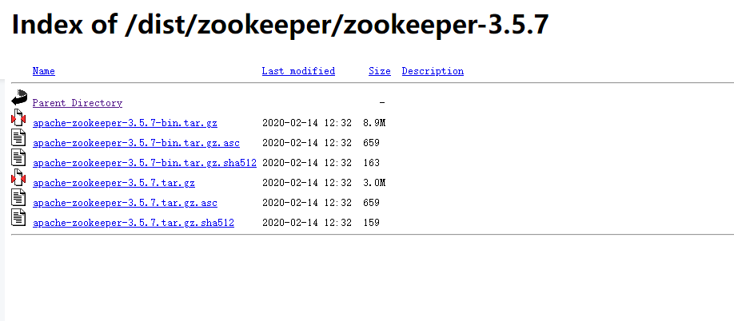
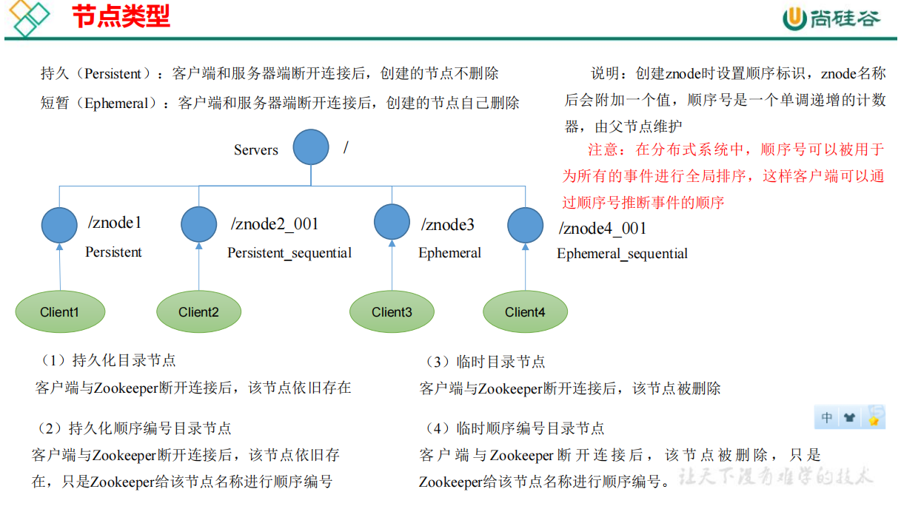

# Zookeeper3.5.7笔记学习记录

## 什么是Zookeeper

1. zookeeper是一个开源的分布式的，为分布式框架提供协调服务的Apache项目

## 单机，集群，分布式的相关概念

1. 单机：将所有的业务全部写在一个项目里面，部署服务到一台服务器上面，所有的业务请求都是由这台服务器处理，当业务增长到一定的程度时候，服务器的硬件满足不了业务的需求，自然而然的我们就想到了将程序部署到多个服务器上面
2. 集群：集群就是单机的多实例，在多个服务器上部署多个服务，每个服务就是一个节点，部署N个节点，处理业务的能力就提高了N倍，这些节点的集合我们叫做集群，负载均衡：协调群里的每个节点均匀的接收业务请求，通俗的讲就是服务A和服务B在相同的时间内接收处理的请求数量差不多，这解决了单机服务器业务过多处理不了的问题。
   1. 集群的特点 ：集群只是单机的多个复制，没有改变单机原来的代码结构，每次部署新节点都只需要复制部署即可。
   2. 单个节点业务耦合度高，资源浪费：节点是多个业务处理集合，简单来说就是每个业务的访问量差异很大，可能账户管理模块访问的很少，但是不得不每台服务器上面都部署一份相同的代码
   3. 每个节点都有所有的模块代码，相对于订单模块来说，其他模块的代码就是浪费
3. 分布式：将单机节点不同的业务处理模块拆开，这就是分布式的核心概念
4. 分布式（微服务）
   1. 分布式结构就是一个完整的系统，按照业务功能，拆分成一个个独立的子系统，在分布式结构中，每个子系统被称为服务，这些子系统能够独立运行在web容器中，之间通过RPC方式通信
   2. 分布式的优点：
      1. 系统之间耦合度大大降低，独立开发，独立部署，独立测试，系统与系统之间的边界明确的非常清楚，排错也变得非常的容易，开发的效率大大提高了。
      2. 系统之间的耦合性降低，从而系统更易于扩展，我们可以针对性地扩展某些服务，就是对子系统集群。例如：双十一时，订单子系统、支持子系统需要集群，账号管理子系统不需要集群。--哪个模块的请求处理压力大，哪些模块可以单独做集群处理。
      3. 服务的复用性更高，比如：我们将用户系统作为单独的服务后，该公司所有的产品都可以使用该系统作为用户系统，无需重复开发。
5. 分布式与集群的区别
   1. 将一套系统拆分成不同子系统部署在不同的服务器上，这叫做分布式
   2. 部署多个相同的子系统在不同的服务器上，这叫做集群
   3. 部署在不同服务器上的同一个子系统应做负载均衡
   4. 分布式：一个业务拆分成多个子业务，部署到多个服务器上面
   5. 集群：同一个业务，部署在多个服务器上面

## Zookeeper的工作机制

zookeeper从设计模式的角度来理解的话是一个基于观察者设计模式的分布式服务管理框架，==负责存储和管理大家都关心的数据，然后接收观察者的注册，一旦这些数据的状态发生改变，zookeeper就会负责通知zookeeper上面注册的哪些观察者做出相应的反应==


## Zookeeper的特点

1. zookeeper是一个leader和多个follower组成的集群
2. 集群中只要有***一半以上***节点存活，那么集群就可以正常的服务，所以zookeeper适合安装奇数台服务器，例如：如果有6台服务器，挂掉了其中的三台，也就是一半，那么这个集群就不能使用了，如果是5台服务器，一半是1.5，挂掉了三台服务器还剩两台，此时集群还是能够正常使用的，这就是为啥要奇数的原因
3. 全局数据一致：每个Server保存一份相同的数据副本，Client无论连接到哪个Server，数据都是一致的
4. 更新请求顺序执行，来自同一个Client的更新请求按照发送的顺序执行：先进先出
5. 数据更新原子性，一次数据更新要么成功，要么失败
6. 实时性，在一定的时间范围内，Client能够读到最新的数据，这是因为zookeeper服务器能够存储的东西很少，所以同步数据很快

## zookeeper的数据结构

ZooKeeper 数据模型的结构与 Unix 文件系统很类似，整体上可以看作是一棵树，每个节点称做一个 ZNode。每一个 ZNode 默认能够==存储 1MB== 的数据，每个ZNode 都可以通过其路径唯一标识


应用场景包括不限于如下

统一命名服务，统一配置管理，统一集群管理，服务器节点动态上下线，软负载均衡

### 统一命名服务

在分布式环境下，经常需要对应用服务进行统一命名，便于表示，ip地址不容易记住，域名更容易记住


### 统一配置管理

1. 一般要求一个集群中，所有节点的配置信息是一致的，比如kafka集群
2. 对配置文件修改后，希望能够快速同步到各个节点上
3. 配置管理可交由zookeeper实现
   1. 可将配置信息写入zookeeper的一个znode
   2. 各个客户端服务器监控这个znode
   3. 一旦znode中的数据被修改，zookeeper将通知各个客户端服务器


### 统一集群管理

1. 分布式环境中，实时掌握每个节点的状态是必要的，可根据每个节点的状态做出调整
2. zookeeper可以实时监控节点的状态变化
   1. 可将节点信息写入到zookeeper上的一个znode
   2. 监听znode可获取实时状态变化


### 服务器动态上下线


### 软负载均衡


## zookeeper下载即安装配置

### 官网地址：[Apache ZooKeeper](https://zookeeper.apache.org/)

### 安装地点

1. 点击下方地址进去下载页面


2. 历史版本下载页面如下


3. 下载指定的版本tar包



### 本地模式安装

#### 安装前置准备

1、安装JDK

2、拷贝下载的tar.gz安装包到Linux系统下

3、解压到指定的目录 ``` tar -zxvf apache-zookeeper-3.5.7-bin.tar.gz -C /opt/module/```

4、修改名称 ```mv apache-zookeeper-3.5.7-bin/ zookeeper-3.5.7```

#### 修改配置文件

1. 将/opt/module/zookeeper-3.5.7/conf目录下的zoo.sample.cfg修改为zoo.cfg;  
   1. ``` mv zoo_sample.cfg zoo.cfg```
2. 打开zoo.cfg文件，修改dataDir路径，修改内容如下
   1. ```dataDir=/opt/module/zookeeper-3.5.7/data```
3. 在zookeeper的根目录文件夹下创建data文件夹
   1. ```mkdir data```

#### 操作启动zookeeper

1. 进入到zookeeper的bin文件夹下面 使用 ```./zkServer.sh start```启动服务器 
2. 使用jps命令查看是否成功启动了zookeeper服务器
3. 查看zookeeper的状态使用 ```./zkServer.sh status```
4. 启动zookeeper的客户端 ```./zkClient.sh ```
5. 输入quit退出客户端
6. 停止zookeeper使用  ```./zkServer.sh stop```

### 集群模式安装

1. 解压文件到指定的linux目录下面

2. 对解压的文件进行重新命名

3. 在data文件下面创建一个myid文件，在文件中添加与server对应的编号，上下不能有空行，左右不要有空格

4. 重命名zoo_sample.cfg文件为zoo.cfg，然后修改这个文件添加如下配置

   1. ```properties
      server.2=zk02:2888:3888
      server.1=zk01:2888:3888
      server.3=zk03:2888:3888
      
      # server.A=B:C:D
      # A表示一个数字，是第几号服务器，集群模式下配置文件myid，文件中的值就是A的值
      # B表示的是服务器的地址
      # C是这个服务器Follower与Leader服务器交换信息的端口
      # D是万一Leader挂了，需要一个端口来重新进行选举，选出一个新的leader，而这个端口就是用来执行选举时相互通信的端口。
      ```

   2. 配置中的1,2,3对应的myid文件中的1,2,3 ，zk01表示的是虚拟机的主机名，可以用ip地址代替，如果想修改主机名 可以配置 /etc/hosts文件

5. 每个服务器的zookeeper的配置文件都应该做相关的配置，然后就是查看zookeeper的状态。

## zookeeper的配置文件参数解读如下

```properties
# 通信心跳时间，zookeeper服务器和客户端心跳时间，单位毫秒
tickTime=2000

# Leader和Follower的初始通信时间，初始连接能容忍的最多心跳数量(tickTime数量)
# 如果操作该时间，默认此次通信是不成功的
initLimit=10

#Leader和Follower的同步通信时间，如果超过了synLimit*tickTime，Leader认为Follower服务器死亡，从服务器列表中删除Follower
syncLimit=5
# zookeeper数据保存的路径
dataDir=/opt/zookeeper/data/

#生成的数据日志路径
dataLogDir=/opt/zookeeper/logs/

# 客户端连接端口，通常不做修改
clientPort=2181

```

zookeeper的选举机制

### 1. zookeeper第一次启动选举


1. 假设当前服务器的台数是5台，服务器1启动的时候投自己一票，此时服务器的台数没有过半以上，选举无法完成，服务器1的状态保持looking
2. 服务器2启动，再次发起一次选举，服务器1和服务器2分别投自己一票并且交换自己的选票，==此时服务器1发现服务器2的id值比自己大==，于是将自己的选票给了服务器2，此时服务器1没有选票，服务器2有两张选票，没有达到半数以上的选票，无法完成选举，此时服务器1和服务2处于looking阶段
3. 服务器3启动，发动一次选举，服务器1,2,3分别交换自己的选票，发现3号服务器的myid是最大的，于是将自己的选票给了3号服务器，此时服务器3号达到了半数以上的选票，服务器3状态为leader，服务器1和服务2的状态修改为follower
4. 服务器4启动，发动一次选举，此时服务器1和服务器2的状态都是follower以及服务器3是leader，不会再相互交换选票的信息，结果为服务器3的票数最多，修改自己的状态为follower
5. 同样服务器5启动也是和服务器4一样的过程

#### 几个相关的名称介绍

1. SID：服务器id，用于标识zookeeper集群中的每一台服务器，每台机器不能重复和myid一致
1. ZXID：事务id，用于标识每一次服务器状态的变更，在某一时候，集群中的每台服务器的ZXID不一定一致，这和zookeeper服务器对于客户端的更新请求处理的逻辑有关
1. Epoch:每个Leader任期的带好，没有leader时同一轮投票过程中的逻辑始终是相同的，每投完一次票，这个数据就会增加。

### 2.zookeeper非第一次启动

当集群中的服务器处于以下两种状态之一的时候，就会出现leader的选举

1. 服务器初始化的时候(第一次启动)

2. 服务器运行期间无法和Leader保持连接的时候

3. 当一台机器进入Leader选举流程的时候，当前集群中可能会保持以下两种状态

   1. 集群中本身就已经存在Leader：这种情况下，服务器发动Leader选举，会被告知服务器的leader状态，对于该机器只需要和leader建立联系即可，并进行状态的同步

   2. 集群中确实不存在Leader

   3. 假设ZooKeeper由5台服务器组成，SID分别为1、2、3、4、5，ZXID分别为8、8、8、7、7，并且此时SID为3的服务器是Leader。某一时刻，3和5服务器出现故障，因此开始进行Leader选举。

      

### 3.zookeeper集群启动

创建文件zk.sh并且添加如下内容

```shell
#!/bin/bash
case $1 in
"start"){
for i in hadoop102 hadoop103 hadoop104
do
echo ---------- zookeeper $i 启动 ------------
ssh $i "/opt/module/zookeeper-3.5.7/bin/zkServer.sh 
start"
done
};;
"stop"){
for i in hadoop102 hadoop103 hadoop104
do
echo ---------- zookeeper $i 停止 ------------ 
ssh $i "/opt/module/zookeeper-3.5.7/bin/zkServer.sh 
stop"
done
};;
"status"){
for i in hadoop102 hadoop103 hadoop104
do
echo ---------- zookeeper $i 状态 ------------ 
ssh $i "/opt/module/zookeeper-3.5.7/bin/zkServer.sh 
status"
done
};;
esac
```

修改文件的权限 chmod u+x zk.sh

./zk.sh start | stop | status 分别用来启动，关闭，查看服务器的状态

## zookeeper命令行的相关操作

1. ls path ：查看当前相关路径下子节点的信息
   1. -s: 添加附加信息(展示的数据会更多)
2. 
   1. cZxid:创建节点的事务id，每次修改zookeeper的状态就会产生一个事务id，事务id是zookeeper中所有修改总的次序，每次修改都有唯一的zxid
   2. ctime：表示znode被创建
   3. mZxid：znode最后更新的事务id
   4. mtime:znode最后修改的毫秒数(从1970年开始)
   5. pZxid：znode最后更新的子节点的事务id
   6. cversion：znode子节点修改次数
   7. dataVersion：znode数据变化号
   8. aclVersion:znode访问控制列表的变化号
3. create node:创建节点信息
   1. -s: 含有序号
   2. -e:表示创建的是临时节点，在客户端断开连接之后节点就会被删除
4. set :设置节点的具体值
5. stat ：查看节点的信息
6. delete: 删除节点信息
7. deleteall :递归删除节点

## 节点类型



* 创建永久节点不带序号： create /sanguo "diaochan"
* 获得节点的值： get -s /sanguo
* 创建永久节点带序号： create -s /sanguo/weiguo "simayi"
* 创建临时节点带序号: create -e -s /sanguo/wuguo "sunquan"
* 创建临时节点不带序号值：create -e /sanguo/wuguo "sunquan"
* 修改节点的值：set /sanguo/wuguo "hehe"

## 监听器原理

客户端注册监听它关心的目录节点，当目录节点下面发生变化的时候(数据变化，节点删除，子目录节点增删)时候，zookeeper会通知客户端，监听机制保证 ZooKeeper 保存的任何的数据的任何改变都能快速的响应到监听了该节点的应用程序


1. 节点的值监听变化
   1. 在一台 节点上监听数据变化 get -w /sanguo 
   2. 在另一台zookeeper客户端设置修改它的值 set /sanguo "sanguo"
   3. 被监听的服务器会出现以下界面
   4. 

2. 使用Java代码的方式实现监听器方式
3. 创建maven项目，导入相关的依赖

```xml
<dependencies>
        <dependency>
            <groupId>junit</groupId>
            <artifactId>junit</artifactId>
            <version>RELEASE</version>
        </dependency>
        <dependency>
            <groupId>org.apache.logging.log4j</groupId>
            <artifactId>log4j-core</artifactId>
            <version>2.8.2</version>
        </dependency>
        <dependency>
            <groupId>org.apache.zookeeper</groupId>
            <artifactId>zookeeper</artifactId>
            <version>3.5.7</version>
        </dependency>
    </dependencies>
```

4. 创建测试类

```java
public class ZkClientTest {
    /**
     * 连接路径
     */
    private String connectionString="192.168.101.101:2181,192.168.101.102:2181,192.168.101.103:2181";
    /**
     * 超时时间单位毫秒
     */
    private int sessionTimeout=100000;

    private ZooKeeper zookeeper;
    /**
     * 初始化zookeeper
     */
    @Before
    public void init() throws IOException {
        //创建连接zookeeper
            zookeeper = new ZooKeeper(connectionString, sessionTimeout, new Watcher() {
            @Override
            public void process(WatchedEvent watchedEvent) {
                List<String> children = null;
                try {
                    children = zookeeper.getChildren("/", true);
                } catch (KeeperException e) {
                    e.printStackTrace();
                } catch (InterruptedException e) {
                    e.printStackTrace();
                }
                for (String child : children) {
                    System.out.println(child);
                }
            }
        });
    }

    @Test
    public void create() throws InterruptedException, KeeperException {
        //创建一个zookeeper节点
        String node = zookeeper.create("/kyrie", "kyrie.avi".getBytes(), ZooDefs.Ids.OPEN_ACL_UNSAFE, 			CreateMode.PERSISTENT);
    }

    /**
     * 获取节点信息
     */
    @Test
    public void getChildren() throws InterruptedException, KeeperException {
        //获取/下面所有的节点信息,true 表示使用初始化中的Watcher
        List<String> children = zookeeper.getChildren("/", true);
        for (String child : children) {
            System.out.println(child);
        }
        //延时处理,让当前方法一直在执行中，方法会调用 Watcher的process方法，方法中获取的时候
        // children = zookeeper.getChildren("/", true); 让监听器一直执行，所以每次有节点变化的时候，就会监听到
        Thread.sleep(Integer.MAX_VALUE);
    }


    /**
     * 判断zookeeper中是否存在节点
     * @throws InterruptedException
     * @throws KeeperException
     */
    @Test
    public void exists() throws InterruptedException,KeeperException {
        Stat exists = zookeeper.exists("/kyrie", false);
        System.out.println(exists==null?"没有获取数据":"存在该节点");
    }
}
```

### 客户端向服务器书写数据

1. 当客户端直接访问的是集群中的leader的时候，数据书写的流程图如下，大致流程如下，首先客户端访问leader，leader有写数据的权限，此时已经完成数据书写的集群服务器数量还没有达到服务器数量的一半以上，不能响应给客户端，leader向follwer中写数据，写数据完成之后，follower响应给leader。次数服务器完成写数据的数量已经达到了一半以上。响应给客户端，然后leader在继续向其他的服务器进行写操作


2. 当客户端访问的不是leader而是follower的话，访问的流程图如下所示：客户端访问follower，follower没有写数据的权限，follower请求leader进行写操作，leader写完之后，让follower进行写操作，follower写完之后响应给leader，每次leader都会判断当前是否已经操超过了集群数量的一半，如果超过了集群数量的一半的话，响应被访问的follower，让follower去ack访问的客户端，然后在数据同步到其他还没有写数据的服务器


## 服务器动态上下线监听案例

需求：某分布式系统中，主节点可以有多台，可以动态上下线，任意一台客户端都能实时感知到主节点服务器的上下线。


实现步骤

1. 在服务器上创建/servers节点 ```create /servers "servers"```
2. 创建客户端代码,客户端主要监听指定目录下面节点的变化情况

```java
public class ZkDynClient {
    private static String connectionString = "192.168.101.101:2181,192.168.101.102:2181,192.168.101.103:2181";

    private static int sessionTimeout = 100000;

    private static ZooKeeper zooKeeper;

    public static void main(String[] args) throws IOException, InterruptedException, KeeperException {
        //1. 连接zookeeper集群
        zooKeeper = new ZooKeeper(connectionString, sessionTimeout, new Watcher() {
            @Override
            public void process(WatchedEvent watchedEvent) {
                try {
                    getServerList();
                } catch (InterruptedException e) {
                    e.printStackTrace();
                } catch (KeeperException e) {
                    e.printStackTrace();
                }
            }
        });
        //2. 监听指定路径的节点增加和减少
        getServerList();
        //3. sleep 保证process方法一直能够监听执行
        Thread.sleep(Integer.MAX_VALUE);

    }

    private static void getServerList() throws InterruptedException, KeeperException {
        //保存所有节点信息
        ArrayList<Object> arrayList = new ArrayList<>();
        List<String> children = zooKeeper.getChildren("/servers", true);
        for (String child : children) {
            byte[] data = zooKeeper.getData("/servers/" + child, false, null);
            arrayList.add(new String(data));
        }
        System.out.println("当前上线的服务列表:"+arrayList);
    }
}
```

3. 服务器端代码主要是注册创建三个节点，当节点上线的时候，客户端能够动态的监听是否上线。

```java
public class ZkDynService {
    private static String connectionString="192.168.101.101:2181,192.168.101.102:2181,192.168.101.103:2181";

    private static int sessionTimeout=100000;

    public static void main(String[] args) throws IOException, InterruptedException, KeeperException {
        //1. 连接zookeeper信息
       ZooKeeper zooKeeper=new ZooKeeper(connectionString, sessionTimeout, new Watcher() {
           @Override
           public void process(WatchedEvent watchedEvent) {

           }
       });
        //2. 注册服务器到zk集群
        zooKeeper.create("/servers/xixi","xixi".getBytes(),ZooDefs.Ids.OPEN_ACL_UNSAFE,CreateMode.EPHEMERAL_SEQUENTIAL);
        zooKeeper.create("/servers/haha","haha".getBytes(),ZooDefs.Ids.OPEN_ACL_UNSAFE,CreateMode.EPHEMERAL_SEQUENTIAL);
        zooKeeper.create("/servers/hehe","hehe".getBytes(),ZooDefs.Ids.OPEN_ACL_UNSAFE,CreateMode.EPHEMERAL_SEQUENTIAL);
        //3. 业务逻辑
        Thread.sleep(Integer.MAX_VALUE);
    }
}
```

